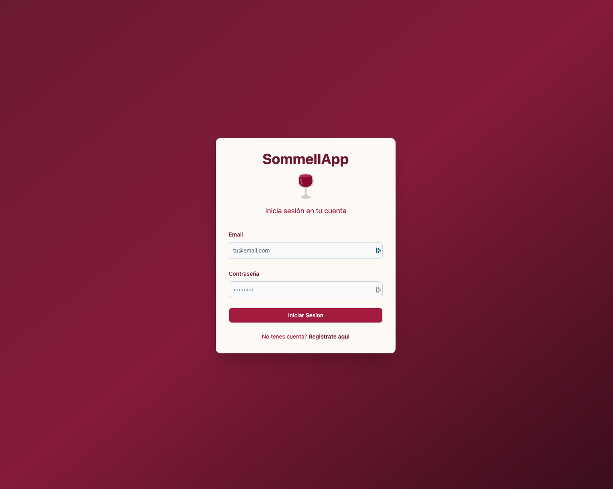
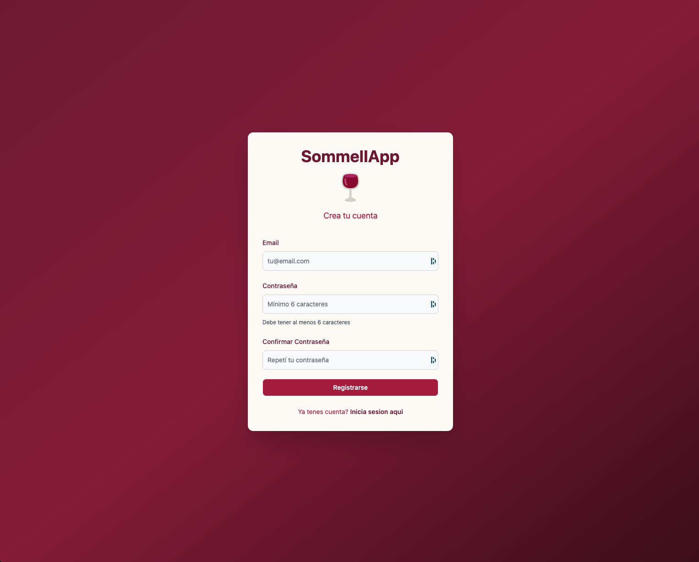
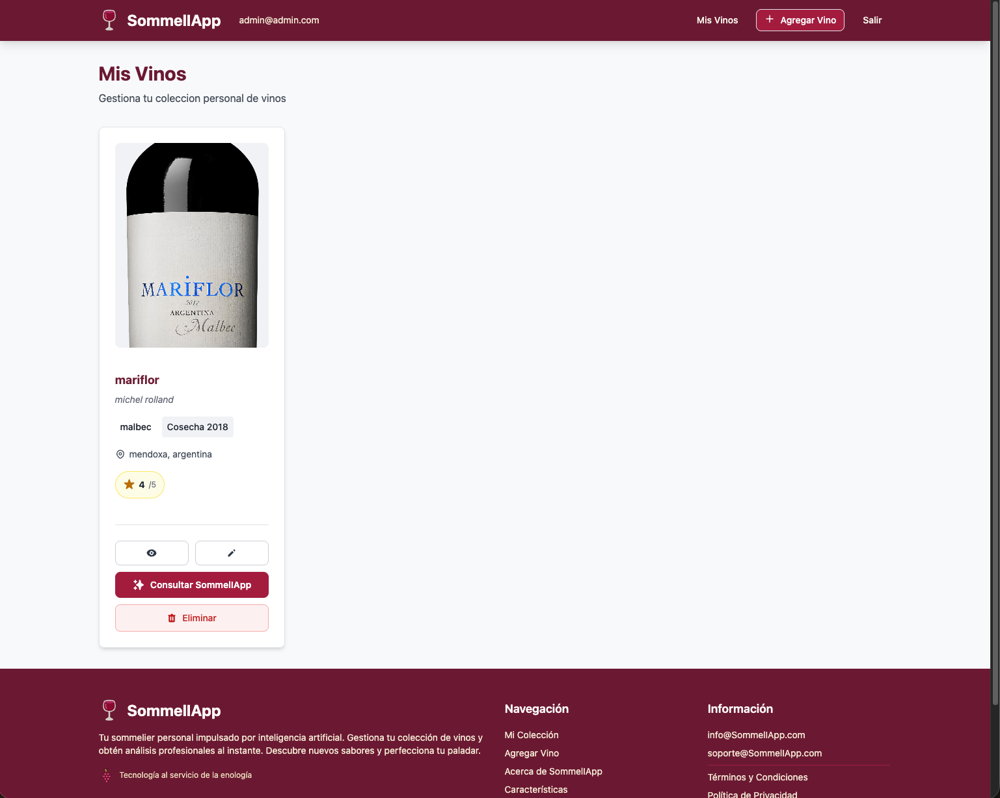
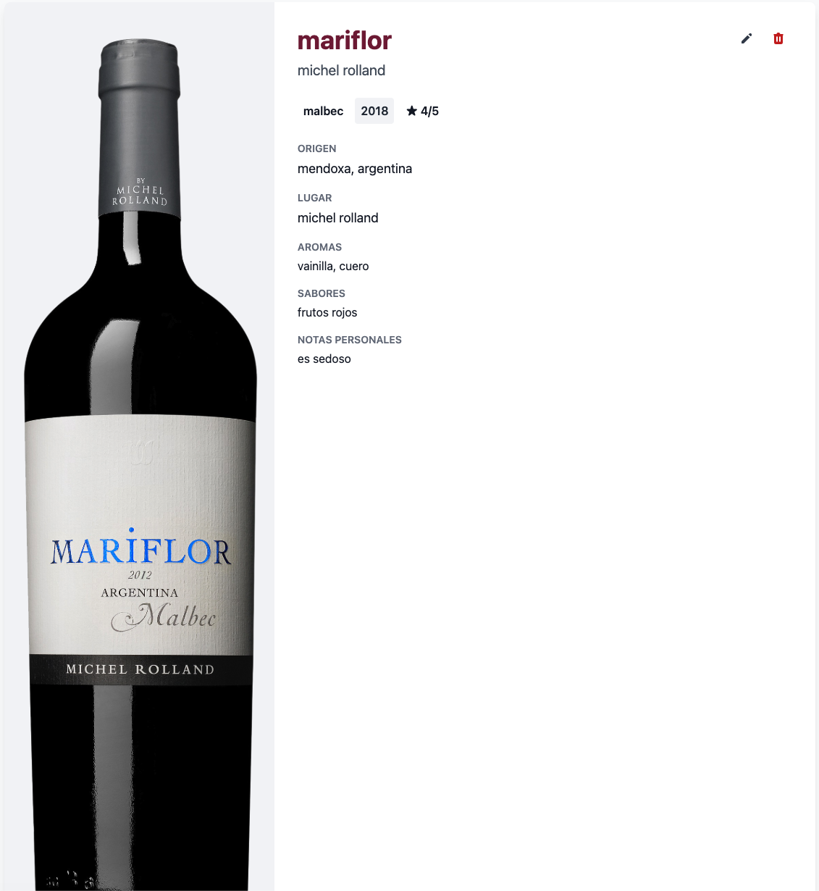
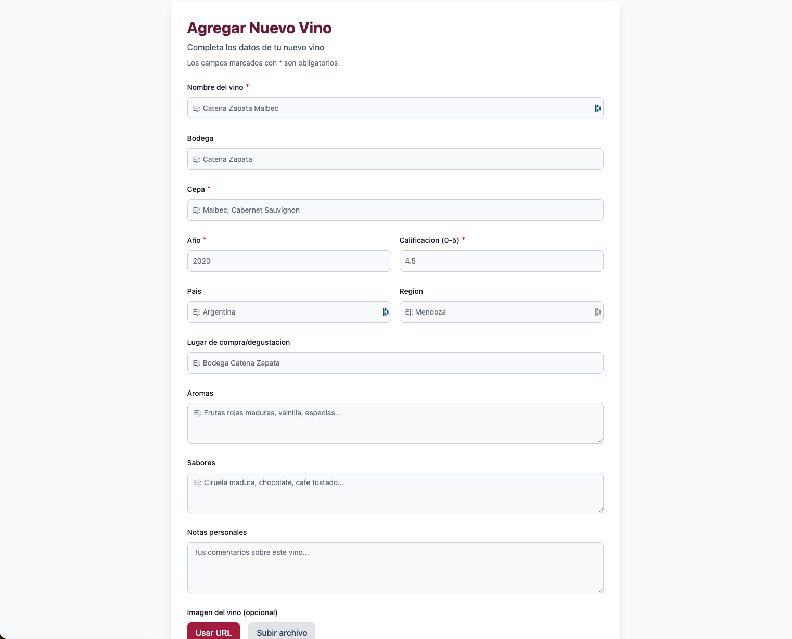
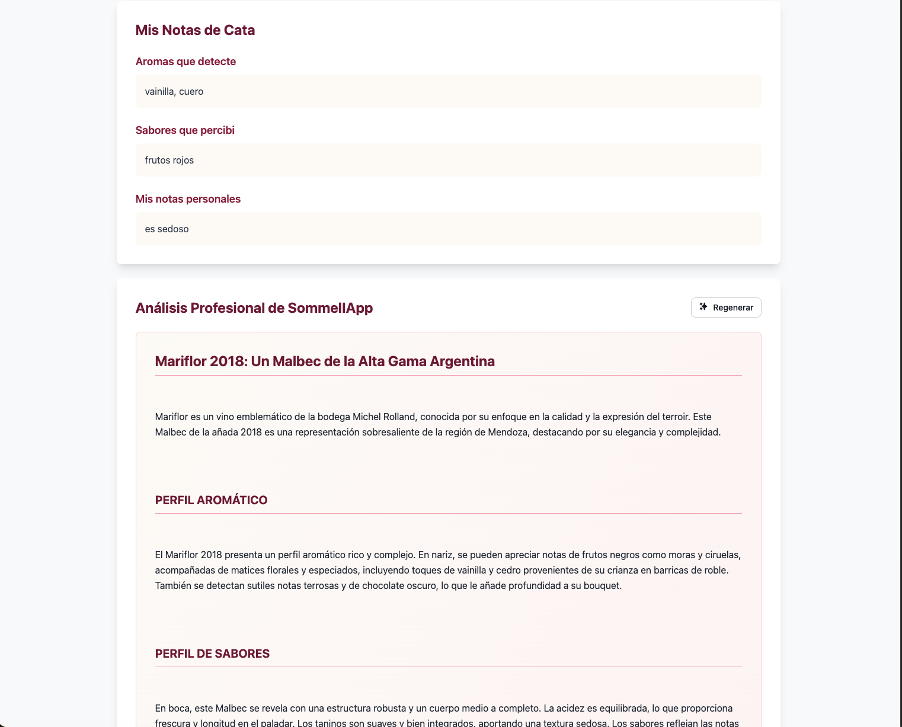

# INFORME TÉCNICO – SOMMELIAPP

## 1. Resumen ejecutivo
SommelIApp es una plataforma full-stack (React + Vite en frontend, Express + SQLite en backend) que permite a usuarios autenticados gestionar su cava personal y solicitar análisis profesionales generados por IA. El presente informe documenta la arquitectura, los flujos funcionales y los contratos de integración que exige el parcial.

## 2. Alcance del informe
- Cobertura funcional: autenticación, CRUD de vinos y consulta al sommelier virtual.
- Descripción técnica: estructura de carpetas, rutas, componentes clave y dependencias principales.
- Contratos de integración: ejemplos de requests/responses para todos los endpoints expuestos.
- Experiencia de usuario: descripción de pantallas y flujos de navegación.
- Gobernanza: lineamientos de commits y consideraciones operativas relevantes.

## 3. Estructura de carpetas
```
p2-pd/
├── backend/
│   ├── package.json            # Dependencias y scripts del servidor
│   └── src/
│       ├── index.js            # Bootstrap de Express, middlewares globales y rutas
│       ├── controllers/        # Lógica de negocio por recurso
│       │   ├── authController.js
│       │   └── wineController.js
│       ├── database/
│       │   ├── db.js           # Conexión SQLite (better-sqlite3) y migraciones
│       │   └── sommelier.db    # Base de datos física
│       ├── middlewares/
│       │   ├── authMiddleware.js   # Validación JWT por request
│       │   ├── validateWine.js     # Reglas de validación para altas/ediciones
│       │   ├── requestLogger.js    # Logging estructurado
│       │   └── errorHandler.js     # Normalización de errores
│       ├── models/
│       │   ├── userModel.js         # Persistencia de usuarios
│       │   ├── wineModel.js         # Persistencia de vinos
│       │   └── aiConsultationModel.js # Historial y cache IA
│       ├── routes/
│       │   ├── authRoutes.js        # /api/auth
│       │   ├── wineRoutes.js        # /api/wines y sommelier
│       │   └── index.js             # Router raíz
│       └── services/
│           └── aiService.js         # Integración con OpenAI + fallback
│
├── frontend/
│   ├── package.json             # Dependencias React/Vite
│   ├── vite.config.js
│   ├── tailwind.config.js
│   ├── postcss.config.js
│   ├── public/
│   │   └── favicon.svg
│   └── src/
│       ├── main.jsx             # Punto de entrada ReactDOM
│       ├── App.jsx              # Router y layout global
│       ├── index.css / App.css  # Estilos base + Tailwind
│       ├── assets/              # Íconos (grapes.svg, wineglass.svg, etc.)
│       ├── components/
│       │   ├── PrivateRoute.jsx # Protección de rutas por token
│       │   ├── BurgerMenu.jsx, Footer.jsx, GrapeLoader.jsx, LoadingModal.jsx
│       │   ├── WineCard.jsx     # Card resumen en listados
│       │   └── WineForm.jsx     # Formularios de alta/edición
│       ├── context/
│       │   └── AuthContext.jsx  # Manejo de sesión (token + usuario)
│       ├── pages/
│       │   ├── LoginPage.jsx, RegisterPage.jsx
│       │   ├── WineListPage.jsx, WineDetailPage.jsx, WineFormPage.jsx
│       └── services/
│           └── apiClient.js     # Cliente HTTP centralizado con manejo de errores
│
└── README.md / INFORME.md       # Documentación operativa y académica
```

## 4. Flujo general de la aplicación
### 4.1 Autenticación
1. `AuthContext` expone `login`, `register`, `logout` y mantiene `token` en `localStorage`.
2. El usuario se registra vía `POST /api/auth/register`. Al finalizar, se ejecuta automáticamente el login.
3. El inicio de sesión (`POST /api/auth/login`) retorna JWT (1 h). El token se adjunta en cada request vía `apiClient`.
4. `PrivateRoute` verifica `isAuthenticated`; si el token falta o expira, redirige a `/login` y limpia la sesión.

### 4.2 Gestión de vinos
1. `WineListPage` consulta `GET /api/wines` al montar, mostrando loader, estado vacío y acciones (ver, editar, eliminar, consultar IA).
2. `WineFormPage` reutiliza `WineForm` tanto en modo creación (`POST /api/wines`) como edición (`PUT /api/wines/:id`).
3. `WineDetailPage` usa `GET /api/wines/:id` para mostrar atributos, notas personales y controles.
4. `deleteWine` dispara `DELETE /api/wines/:id` con confirmación y feedback vía `toast`.

### 4.3 Consulta SommelIApp (IA)
1. Desde la lista o el detalle se invoca `consultSommelier` → `POST /api/wines/:id/sommelier`.
2. El backend valida propiedad del vino, revisa cache (`aiConsultationModel`); si existe respuesta y no se solicitó regeneración (`forceRegenerate=false`), la reutiliza.
3. Si no hay cache: `aiService.generateSommelierNotes` arma prompt, llama a OpenAI (`gpt-4o-mini`). Sin API key o ante error, se produce un fallback simulado.
4. Los resultados se guardan en `wine_ai_consultations`, se actualiza `wines.ai_notes` y el flag `ai_consulted`.
5. El frontend muestra un modal de carga (`LoadingModal` o `GrapeLoader`), luego renderiza el análisis con formato enriquecido.

### 4.4 Manejo transversal
- **Validaciones**: `validateWine` asegura campos requeridos (nombre, cepa, calificación en rango, etc.).
- **Seguridad**: todas las rutas `/wines` utilizan `authMiddleware` para validar el JWT.
- **Logging y errores**: `requestLogger` guarda método, ruta y tiempo de respuesta. `errorHandler` normaliza mensajes antes de responder al cliente.

## 5. API REST y contratos JSON
### 5.1 Autenticación
**Registrar usuario** – `POST /api/auth/register`
```json
{ "email": "usuario@ejemplo.com", "password": "securePass1" }
```
Respuesta 201:
```json
{ "message": "User registered successfully", "user": { "id": "uuid", "email": "usuario@ejemplo.com" } }
```
Errores habituales: `400 Email inválido`, `400 El email ya está registrado`.

**Login** – `POST /api/auth/login`
```json
{ "email": "usuario@ejemplo.com", "password": "securePass1" }
```
Respuesta 200:
```json
{ "token": "<jwt>", "user": { "id": "uuid", "email": "usuario@ejemplo.com" } }
```
Errores: `401 Credenciales inválidas`, `500 Error de configuración del servidor` (si falta `JWT_SECRET`).

### 5.2 Gestión de vinos (requiere `Authorization: Bearer <token>`)
**Listar vinos** – `GET /api/wines`
Respuesta 200:
```json
{
  "data": [
    {
      "id": "3a6f...",
      "name": "Malbec Reserva",
      "grape": "Malbec",
      "rating": 4.5,
      "aiConsulted": 1,
      "createdAt": "2025-11-18T10:00:00.000Z"
    }
  ]
}
```

**Obtener por ID** – `GET /api/wines/:id`
```json
{
  "data": {
    "id": "3a6f...",
    "name": "Malbec Reserva",
    "winery": "Bodega Norton",
    "grape": "Malbec",
    "year": 2020,
    "country": "Argentina",
    "region": "Mendoza",
    "place": "Vinoteca Central",
    "rating": 4.5,
    "aromas": "Frutas rojas, vainilla",
    "flavors": "Taninos suaves",
    "notes": "Excelente para carnes rojas",
    "imageUrl": "https://...",
    "aiNotes": "Análisis completo...",
    "createdAt": "2025-11-18T10:00:00.000Z",
    "updatedAt": "2025-11-18T10:05:00.000Z"
  }
}
```
Errores: `404 Wine not found` cuando el ID no pertenece al usuario autenticado.

**Crear vino** – `POST /api/wines`
```json
{
  "name": "Cabernet Gran Reserva",
  "winery": "Viña Montes",
  "grape": "Cabernet Sauvignon",
  "year": 2019,
  "country": "Chile",
  "region": "Colchagua",
  "place": "Vinoteca Central",
  "rating": 4.2,
  "aromas": "Cassis, tabaco",
  "flavors": "Taninos firmes, final largo",
  "notes": "Ideal para carnes a la brasa",
  "imageUrl": "https://cdn.example.com/cabernet.jpg"
}
```
Respuesta 201: mismo cuerpo del vino creado (con `id`, `createdAt`, `updatedAt`).
Errores: `400` por validaciones de `validateWine`, `401` si falta token.

**Actualizar vino** – `PUT /api/wines/:id`
```json
{
  "rating": 4.8,
  "notes": "Mejorado tras decantación",
  "imageUrl": "https://cdn.example.com/cabernet-new.jpg"
}
```
Respuesta 200: vino actualizado completo. Si el ID no existe: `404 Wine not found`.

**Eliminar vino** – `DELETE /api/wines/:id`
Respuesta 200:
```json
{ "message": "Wine deleted successfully" }
```

### 5.3 Consulta SommelIApp (IA)
**Generar o recuperar análisis** – `POST /api/wines/:id/sommelier[?forceRegenerate=true]`
Request sin body (solo token). Respuesta 200:
```json
{
  "data": {
    "aiNotes": "Análisis profesional estructurado...",
    "wine": {
      "id": "3a6f...",
      "name": "Malbec Reserva",
      "aiNotes": "Análisis profesional estructurado...",
      "aiConsulted": 1,
      "updatedAt": "2025-11-18T10:07:00.000Z"
    },
    "fromCache": false,
    "consulted": true
  }
}
```
Errores: `404 Wine not found` si el vino no pertenece al usuario; `500` si OpenAI falla y el fallback también.

## 6. Descripción de pantallas y flujos de uso
### 6.1 Login
- **Objetivo**: autenticar usuarios existentes.
- **Componentes**: `LoginPage`, `AuthContext.login`, Flowbite `Form` + `Alert`.
- **Flujo**: el usuario completa email/contraseña → `handleSubmit` llama `login` → al éxito navega a `/wines`; ante error se muestra `Alert` con mensaje del backend.



### 6.2 Registro
- **Objetivo**: alta de nuevos usuarios reutilizando la lógica de login.
- **Flujo**: `RegisterPage` dispara `AuthContext.register` → se envía `POST /api/auth/register` → al éxito se encadena `login` y se redirige a `/wines`.



### 6.3 Listado de vinos (`/wines`)
- **Objetivo**: vista principal con cards (`WineCard`) y acciones.
- **Estados**: loader inicial, error con opción “Reintentar”, estado vacío con CTA para crear primer vino, grilla responsive.
- **Acciones**:
  - Ver detalle → `navigate(/wines/:id)`.
  - Editar → `navigate(/wines/:id/edit)`.
  - Eliminar → confirmación `window.confirm` + `deleteWine`.
  - Consultar SommelIApp → `consultSommelier` muestra `LoadingModal`, actualiza el vino y navega al detalle.
  - Logout → `AuthContext.logout` limpia localStorage y redirige.



### 6.4 Detalle de vino (`/wines/:id`)
- **Contenido**: imagen, origen, notas personales, badges (cepa, añada, rating) y sección de IA.
- **Flujos clave**:
  - `consultSommelier` desde el detalle: muestra `GrapeLoader`, actualiza `aiNotes` y permite regenerar.
  - Edición / eliminación reutilizando mismo patrón que la lista.
  - Navegación segura con botón “Volver a Mis Vinos”.



### 6.5 Formulario de vino (`/wines/new` y `/wines/:id/edit`)
- **Composición**: `WineForm` maneja inputs controlados, validaciones básicas y estado de carga.
- **Flujos**:
  - Alta: `createWine` y redirección al listado.
  - Edición: precarga con `getWineById`, `updateWine` al confirmar.
  - Cancelar: vuelve al listado sin cambios.



### 6.6 Interacción IA (modal/loader)
- **Componentes**: `LoadingModal`, `GrapeLoader`, `toast` de feedback.
- **Flujo**: mientras `consultSommelier` está pendiente se bloquea la UI contextual, se notifica al usuario y se muestran errores en caso de fallas.



## 7. Consideraciones adicionales
- **Persistencia**: SQLite almacena usuarios, vinos y consultas IA. Los IDs son UUID v4 generados con `crypto.randomUUID()`.
- **Seguridad**: bcrypt para hash de contraseñas, JWT con expiración de 1 hora, CORS configurado en backend (ver `src/index.js`).
- **Fallback IA**: cuando falta `OPENAI_API_KEY` o la cuota expira, se generan notas simuladas basadas en los datos capturados por el usuario.
- **Despliegue**: frontend disponible en Vercel (`https://sommeliapp.vercel.app/login`) consumiendo una API de backend hosteada en Render; todo el flujo puede probarse end-to-end con esas URLs públicas.

## 8. Convención de commits
Usar siempre el formato:
```
git commit -m "[#<ticket>][<TIPO>] Mensaje descriptivo"
```
- `<ticket>`: número de issue o requerimiento (ej.: `#3`).
- `<TIPO>`: `FEATURE`, `TASK` o `HOTFIX` según corresponda.
- **Ejemplos**:
  - `git commit -m "[#1][FEATURE] Registrar usuario con JWT"`
  - `git commit -m "[#4][TASK] Documentar flujo SommelIApp"`
  - `git commit -m "[#7][HOTFIX] Corregir validación de rating"`

## 9. Referencias rápidas
- **Frontend dev server**: `cd frontend && npm install && npm run dev`.
- **Backend API**: `cd backend && npm install && npm run dev` (requiere `.env` con `PORT`, `JWT_SECRET`, `OPENAI_API_KEY` opcional).
- **Variables relevantes**:
  - Backend: `PORT`, `JWT_SECRET`, `OPENAI_API_KEY`.
  - Frontend: `VITE_API_URL` apuntando al backend.

Este informe cubre todos los requisitos del parcial: estructura de carpetas, flujo general, contratos JSON, descripción detallada de pantallas y lineamientos de trabajo colaborativo.
